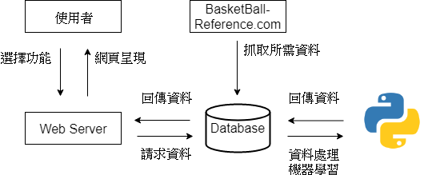
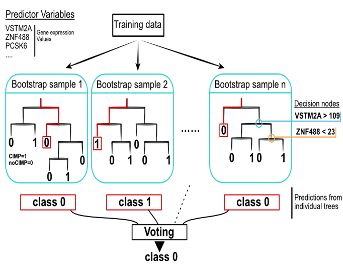

# National Basketball Scout

### Motivation
對於剛開始接觸NBA 的球迷，往往想要更進一步了解籃球的資訊時，會因為一堆文字及數據而退卻，因此我們希望能夠透過數據視覺化的方式，提供球迷更加友善的管道了解自己所喜愛的球隊及球員。近年機器學習蓬勃發展，於體育界也有許多案例，最著名的就是「魔球理論」，透過數據的預測及分析球員發展，因此我們也透過機器學習，來預測MVP 及球隊排名，以提供有興趣的球迷當作參考。

### Introduction
本專案為建構一個基於資料分析的球探系統，以Vue.js作為網頁前端框架，並使用Node.js 系統實做後端服務，我們使用Requests將資料從網站上爬取下來，再將資料利用Pandas做基礎資料前處理後儲存於Firestore，使用v-charts將資料以視覺化方式呈現於網頁上，並scikit-learn進行隨機森林機器學習，預測球隊排名及最有價值球員(MVP)。於機器學習訓練過程中，為提升R²決定系數需不斷調整特徵及模型參數，以尋找出最佳模型，最後則是使用K-fold進行最後驗證，以確保模型的精準度並減少過度擬合的問題。

### Mechine Learning
我們選用隨機森林演算法，選擇原因有二，一是因為其較適合高維度的資料，二是因為此演算法選用訓練的特徵彼此相關性不能過高，而這也符合我們的需求。在訓練的過程中，我們需不斷的使用GridSearchCV調整參數及挑選特徵，以尋找最佳模型

### Verification
模型的驗證方式我們使用K-Fold交叉驗證，將資料切分為K個賽季，每次取一個做為驗證資料，K-1個做為訓練資料，直到每一筆資料都當過驗證資料為止，最後再將每一次的結果做平均及標準差的計算，以此當作模型好壞的依據，如結果不盡人意，則回去檢視模型的參數及特徵選取是否有可以加強的部分。

### Developers
* Willie 陳哲葦
* Aaron 黃彥穎
* AXiangla 鄭宇翔
